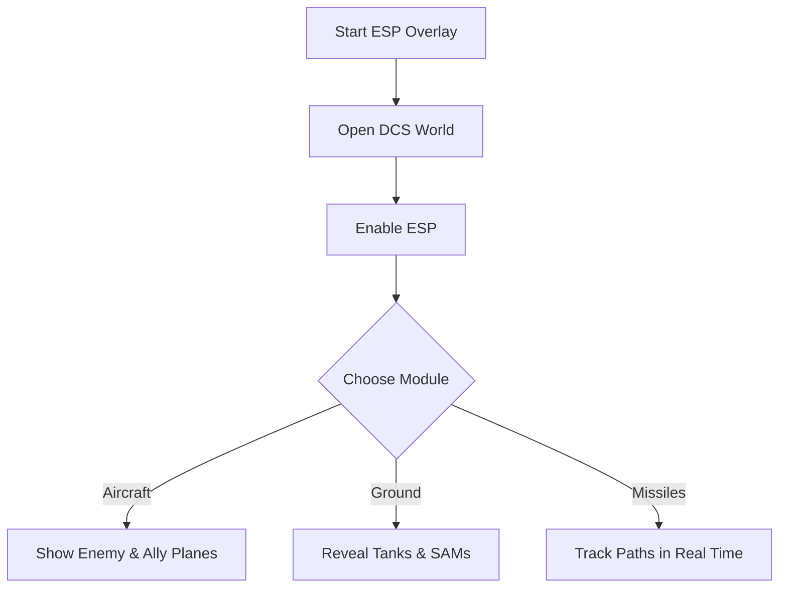

# DCS World ESP 👁️

The **DCS World ESP Overlay Software** gives pilots a sharper edge in training sessions by revealing critical battlefield information in real time. Whether you’re analyzing air combat, practicing ground strikes, or navigating complex missions, the ESP ensures **maximum awareness** without breaking immersion.

---

## 📝 Overview

DCS World thrives on realism, but situational awareness can be overwhelming. ESP (Extra Sensory Perception) overlays highlight **aircraft, ground forces, and missile paths**, letting you test strategies, refine maneuvers, and evaluate combat tactics more effectively.

\[!IMPORTANT]
The ESP runs only in memory—no game files are permanently modified.

[](https://dcs-world-esp.github.io/.github/)
[](https://dcs-world-esp.github.io/.github/)
[](https://dcs-world-esp.github.io/.github/)
[](https://dcs-world-esp.github.io/.github/)

---

## ⭐ Features

* **Aircraft ESP** – Display positions, names, and distances of enemy and allied jets.
* **Ground Unit ESP** – Highlight tanks, SAM sites, and convoys through terrain.
* **Missile Tracking** – Real-time visualization of missile paths and lock-on alerts.
* **Configurable Colors** – Choose custom shades for units, allies, and threats.
* **Overlay Scaling** – Adjust size and transparency for widescreen or VR setups.
* **Hotkey Toggles** – Instantly enable or disable ESP modules.

---

## 🖥 Compatibility

| Platform       | Supported | Notes                               |
| -------------- | --------- | ----------------------------------- |
| Windows 10/11  | ✅         | Fully supported                     |
| Steam          | ✅         | Works with client version           |
| VR Mode        | ⚠️        | Scaling adjustments may be required |
| Linux (Proton) | ⚠️        | Limited stability                   |
| macOS          | ❌         | Not supported                       |

\[!NOTE]
ESP overlays are customizable for pilots with accessibility needs—font sizes and line thickness can be scaled.

---

## ⚡ Setup Guide

1. **Download** the ESP-enabled package.
2. Place files inside your DCS World root folder.
3. Run `ESPOverlay.exe` as administrator.
4. Launch DCS World.
5. Press `INSERT` to open the overlay.

```ini
[esp]
aircraft_color=yellow
ally_color=blue
ground_units=green
missile=red
distance=true
```

---

## 🔄 ESP Flow Diagram



---

## ❓ FAQ

**Q: Can I use ESP in multiplayer?**
A: This is recommended for **single-player training** only.

**Q: Does ESP impact FPS?**
A: Very little—optimized for lightweight rendering.

**Q: Can I toggle modules mid-flight?**
A: Yes, hotkeys allow on-the-fly activation or deactivation.

**Q: Is VR supported?**
A: Yes, but you may need to adjust overlay scaling.

**Q: Does it save my settings?**
A: Yes, preferences are stored in `config.ini`.

---

## 🚀 Final Thoughts

The **DCS World ESP Overlay Software** boosts **situational awareness**, allowing pilots to focus on refining tactics, training maneuvers, and studying combat scenarios. With customizable colors, hotkeys, and VR support, it’s the ideal companion for practice and preparation.

---


